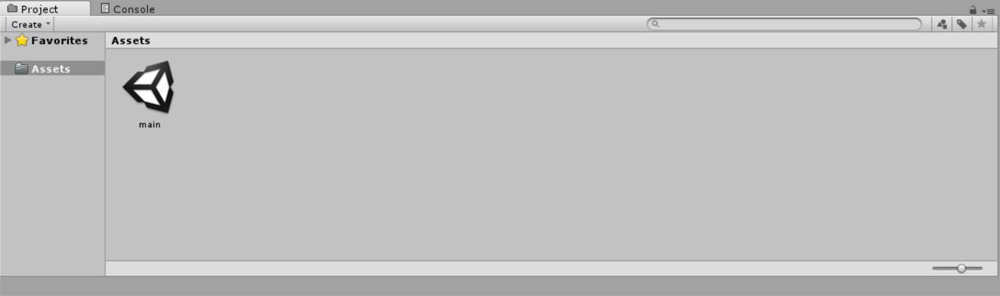
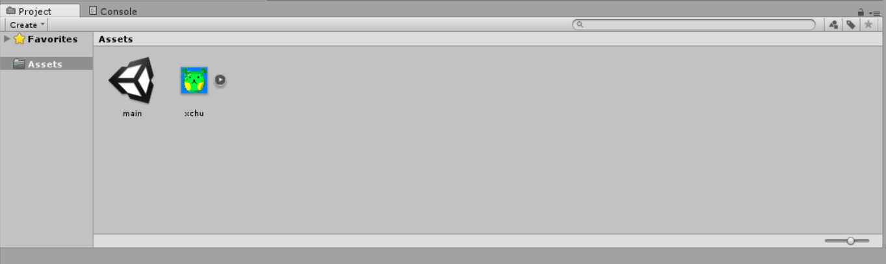
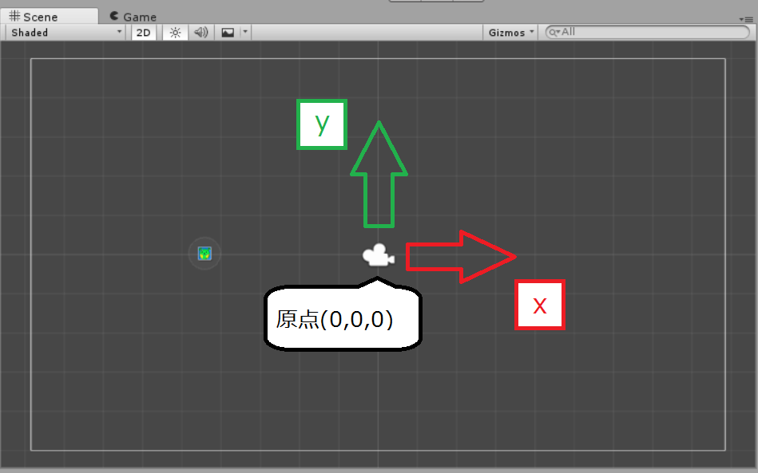

<!-- $theme: gaia -->
<style>
.center{
 text-align: center;
}
</style>

<!-- template: gaia -->

# Unity講座
## 2.Unityの使い方

----
<!-- page_number: true -->
<!-- template: invert-->

# 1
# UnityEditor

----

<!-- template: -->
## Toolbar

画面上部にあるボタン群
中央にあるボタンでゲームの実行や一時停止が出来る

:collision:==注意==
実行中に行った変更はすべてもとに戻される
:arrow_right:必ず実行中でないか確かめること

----

## Projectウィンドウ

`File > Save Scenes`をして現在の状態を保存 

:arrow_right:画面下部に設定した名前のUnityアイコンが出現


----

## Projectウィンドウ

- ゲームで使用するドット絵やBGM、プログラムファイルなどの素材を管理する場所
- `Assets`フォルダが親フォルダ
- エクスプローラーのようにフォルダ分けして管理することが出来る

----

## Projectウィンドウ
#### :collision:注意

ここにあるのは **==「ゲームの素材候補」==** 

ゲームで使うものは必ずここに置く必要があるが、
ここにあるからといって必ずしもゲームに登場させる必要はない

つまり、ここにあるだけでは
**==Unityはゲームに登場するものとして認識しない==**  

----

## Projectウィンドウ

画像を使うためにProjectウィンドウに入れる

1. 画像を右クリックして保存
2. D&DでProjectウィンドウのAssetsフォルダへ
 
 
これでゲーム内で画像を使う準備は出来た

----

## Projectウィンドウ

#### :heavy_check_mark:TIPS - ファイル名の変更

任意のファイルに対しシングルクリックを2回(ダブルクリックではない)でファイル名の変更が出来る

選択した上でF2キーを押すことでも出来る

----

## Sceneビュー

- 画像などを実際に確認しながら配置できる
- ツールバーでマウスポインタを選ぶ
	- 視点移動
	- オブジェクトの移動
	- オブジェクトの回転
	- オブジェクトのサイズ変更
	- オブジェクトに対する操作全般

----

## Sceneビュー

-Sceneビュー内には座標軸が存在する


----

## Hierarchyウィンドウ

- ゲーム上に存在するオブジェクトの一覧が表示
- HierarchyにD&Dすることでも表示出来る
- Hierarchyでは任意のオブジェクトをダブルクリックでフォーカス
- Main Camera:
	- Sceneビュー内のゲーム画面に出力する場所  
	- カメラに映ったものがゲーム画面として出力される
- オブジェクトの右クリックで名前変更や複製

----

## Inspectorウィンドウ

- Hierarchyで選択したオブジェクトの詳細を見たり設定を行う  

さっきProjectウィンドウに取り込んだ画像の設定
- FilterMode : `Point (no filter)`

こうすることで画像を拡大してもぼやけない

実際に位置や回転、大きさを変えてみよう

----

## 「オブジェクト」の概念

- Hierarchy上にあるのは`GameObject`と呼ばれるもの
- `GameObject`はUnityにおいてゲームに存在するための枠組みであり、基礎となるもの
- 様々な機能を持った==コンポーネント==と呼ばれるものがくっつくことで初めて==役割を持ったもの==として動作する

例えば、先程取り込んだ画像は
- `Transform`
- `SpriteRenderer`

----

## 「オブジェクト」の概念


- `Transform`コンポーネントは例外なくすべてのGameObjectに付与されており外せない
- コンポーネントはオン/オフで機能を止められる
	- ==<例>== SpriteRendererをオフにしてみよう
- 右端のメニューからコンポーネントの削除や並び替えが出来る

----

## Consoleウィンドウ

実行時のエラーなどが表示され、バグ探しに使う

:warning:必ず見える位置に移動しておこう

----

<!-- template:invert -->
# 2
# Unityでプログラムを書く


----

<!-- template: -->
## Unityでプログラムを書く

ここまで
:arrow_right:画像の配置やその大きさや回転の調整を行える

しかしゲームではない
:arrow_right:Game Objectに **==プログラムをコンポーネントとしてくっつける==** ことで、様々な動作を行える

----

## Unityでプログラムを書く

まずはプログラムを書くためのファイルを作る

1. Projectウィンドウで右クリック
2. `Create` > `C# Script`
3. 名前を設定しスクリプトファイルを作成
4. 作成したファイルをHierarchyにある画像にD&D

ここで今表示されている画像を自機とするため、
名前は`me`や`player`が望ましい

----

## Unityでプログラムを書く

#### :collision:==注意==

Projectウィンドウにあるだけでは、
このスクリプトファイルは==何もしない==

Projectウィンドウにあるのはあくまで素材候補
:arrow_right:必ずコンポーネントとしてくっつける必要がある

----

## Unityでプログラムを書く

プログラムを編集する
:arrow_right:C#ファイルをProjectからダブルクリック
　:arrow_right:プログラムを書くことで様々な動作をさせる


----
## Unityでプログラムを書く

```CSharp
using System.Collections;
using System.Collections.Generic;
using UnityEngine;

public class me : MonoBehaviour {

	// Use this for initialization
	void Start () {
	}

	// Update is called once per frame
	void Update () {
	}
}
```

プログラムというものは普通の文章と同じように、
左上から1行ずつ、順番に読み取られていく

----
## プログラムの書き方の注意事項

- 全角文字を使わない

　全角文字はエラーになるので基本的にプログラムに使ってはいけない
全角スペースなどを入力してしまうとエラーの原因に気が付きにくい、気を付けよう

- コメント文のつけ方

プログラム内で`//`が書かれた場合、それ以降はプログラムの一部として扱われることの無いコメント文となる

----
### Start関数

```CSharp
	// Use this for initialization
	void Start () {

	}
```
これは`Start`関数

`{}`の中に書かれたプログラムを、
ゲームの起動時に一度だけ実行する

----
### Start関数の動き

Start関数を下のように書き足す

```CSharp
    // Use this for initialization
    void Start () {
        print("start");
    }
```

1. `Ctrl+S`でファイルの保存
2. Unityの画面に戻る  
2. Toolbarの再生ボタンを押す
3. Consoleウィンドウに`start`と表示される

----

### print("start");

```CSharp
	print("start");
```

これは`()`の中に書いたものを、
Consoleウィンドウに出力するための==関数==というもの

- プログラムで文字を扱う場合、必ず`""`で囲う
- `;`はひとつの動作が終了した、という合図  
- プログラムの一動作ごとにその末尾に`;`を付ける

----
### Start関数

Consoleウィンドウに正しく`start`の文字が表示

:white_check_mark:`print("start")`は正しく実行された
:white_check_mark:一度だけ実行された

確認ができたので実行を終了させ、
Consoleの左上、`Clear`をクリックしてConsoleウィンドウの中身を消す


----

### Update関数

```CSharp
	// Update is called once per frame
	void Update () {

	}
```

これは`Update`関数

`{}`の中に書かれたプログラムを、
==1フレームに1回==実行する関数

----

### フレームレート

 - ゲームの更新頻度のこと

ゲーム内では常にキャラの画像更新や演算が行われているわけでは無い

１フレームという単位であらゆる演算を行っている


----
### Update関数の動き

次のように書き足してみよう

```CSharp
	// Update is called once per frame
	void Update () {
            print("update");
	}
```

1. 先程同様保存しUnityで実行する
2. Consoleウィンドウに`update`の文字が次々に現れる


:arrow_right:毎フレーム`print("update");`を実行しているから

----
### Update関数の動き

Consoleの一番上の文字が`start`になっている

:arrow_right:`Start()`内の記述は`Update()`内の記述よりも
==先に一度だけ==実行されることがわかる

これは次回以降重要になる部分なので覚えておこう

----
<!-- template: default -->
# まとめ

- GameObjectはゲームに存在するための枠組み
- コンポーネントによって役割を持つ
- プログラムもコンポーネントとしてくっつける
- Start関数は起動時1度だけ実行
- Update関数は毎フレーム実行

----
<!-- template: gaia -->
<!-- page_number: false -->

# やってみよう！
###### 分からないことがあったら周囲の先輩に聞いてみよう