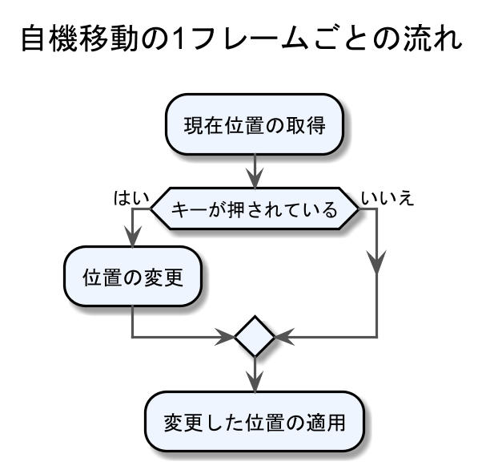

<!-- $theme: gaia -->
<style>
.center{
 text-align: center;
}
.center img{
}
</style>

<!-- template: gaia -->

# Unity講座
## 3.自機の移動

----
<!-- page_number: true -->
<!-- template: default -->
# 目的

:arrow_right_hook:**==前回==**
画像の表示は出来た

これではいつまでたっても動かない 
:arrow_right:矢印キーを押したら自機が動く

----

### プログラムの流れ
<div class="center">
   
</div>


----

### もくじ

1. 現在位置の取得
2. キー入力の受け取り
3. 位置の変更
4. 変更した位置の適用

----

## 今日使うプログラムのコピペ

1. Projectウィンドウで`右クリック > Create > C# Script`
1. 作成したスクリプトファイルをダブルクリック 
1. 資料ページ一番下のプログラムをコピーする
1. MonoDevelop(エディタ)上にペーストし**保存する**

----

## :boom:**注意**

クラス名とファイル名は常に同一でなければならない
  

- プログラムをGameObjectにくっつけられない
- プログラムコンポーネントに:warning:マークが出ている

  

----

# 1
# 現在位置の取得

----

## 変数

### 変数の使い方
現在位置を取得してから適用するまで、
現在位置情報をプログラムは保持しておく必要がある

:arrow_right:プログラムで情報の保持に使うのが ==「変数」== 

変数には値を自由に出し入れすることができる

----
### 変数の使い方

変数を使うためには「この変数を使います」と宣言する必要がある

```CSharp
    int number;
```

これで`number`という名前の変数が使えるようになる

----

### 変数の使い方

```CSharp
    int number;
```
- `int`は変数のタイプを表す==型==
- `int`型の変数には整数を入れることが出来る  
- ==型==は変数に入れる情報によって変える必要がある

----
### 変数の使い方
<!-- template: invert -->

用意した変数に、実際に情報を入れる
```CSharp
    int number;
    number = 2;
```
これを変数への**代入**

:boom:代入の操作は何度でもでき、**上書き**される

```CSharp
    int number;
    number = 2;
    number = 5;
```
----
### 変数の使い方

- 変数の宣言と代入は同時に行うことが出来る
- 一度に複数の変数を宣言できる

```CSharp
    int number = 2;
    int a = 0, b = 1, c = -1;
```

----
<!-- template: default -->
### 変数の使い方

`int`以外に、変数の型には以下のようなものがある
入れたい情報に応じて適宜選んであげる必要がある

----
<!-- template: invert -->
### データ型いろいろ

1. **整数 :** `int`  
そのまま数字を書くだけ

```CS
	int a = 123;
```

2. **小数 :** `float`  
小数を扱う場合、
`1.5f`というように、末尾に`f`を付ける
整数も代入でき、その場合数字のみでよい

```C
	float b = 1.5f;
	float c = 3;
```
----
### データ型いろいろ

3. **文字列 :** `string`  

ダブルクオーテーション(`"`)でくくる
`"abc"`や`"123"`などは文字列

```CS
	string d = "Hello";
	string e = "123";
	int    f = 123;
```

`123`と`"123"`は違うデータ型であることに注意

----

### データ型いろいろ

4. **真偽値 :** `bool` 
 
真偽値とは、「正しい」「正しくない」の2種類の値のみを取れる特殊な値
「正しい」は`true`、「正しくない」は`false`と表す

```CS
	bool   g = true;
	string h = "true";
```

`true`と`"true"`は違うデータ型であることに注意

----
<!-- template: default -->
### データ型いろいろ

まとめ


|型|代入するもの|例|
|:--:|:--:|:--|
|int|整数|` int a = 5;`|
|float|小数|`float b = 1.5f;`|
|string|文字列|`string c = "Hello";`|
|bool|真偽値|`bool d = true;`|

----

### :warning: 変数の注意点

- 型に合わない情報を変数に入れられない 
    :o:`int a = 100;`  
    :x:`int a = "TEST";`  
- 変数名には 半角英数字とアンダーバーが使用可
    :o:`int player_1 = 100;`

- 変数名の先頭の1文字は 数字の使用 **==不可==**  
    :x:`int 1_player = 100;`

- 変数名に **.** や **:** などの記号は使用 **==不可==**  
    :x:`int player.1 = 100;`

----
<!-- template: invert -->
### 変数と式
変数には計算結果を入れることが出来る

```cs
    <足し算>
    int a = 1 + 2;
    <引き算>
    int b = 3 - 1;
    <掛け算>
    int c = 2 * 5;
    <割り算>
    int d = 6 / 2;
    int e = 5 / 2; (小数点以下は切り捨て)
    <剰余>
    int f = 5 % 2; 
```
----
### 変数と式
- 四則計算の優先順位は基本的に数学と同じ
- くくることで優先順位を明示することができる
```CSharp
    int a = 2*3 + 2*4; (14が代入される)
    int b = 2*(3+2)*4; (40が代入される)
```

変数同士の計算もできます。
```CSharp
    int a = 1, b = 2;
    a = a + b;
```

----
### 変数と式

自分自身に対して計算する場合は省略可能
```CSharp
    int a = 1;
    a += 2;      (1+2で 3が代入される)
    a -= 1;      (3-1で 2が代入される)
    a *= 3;      (2*3で 6が代入される)
    a /= 6;      (6/6で 1が代入される)
```

----
<!-- template: default -->
## 現在位置の取得

座標はフレーム毎に取得する
:arrow_right: `Update()`の中に記述する

位置情報は`Transform`コンポーネントが持っている
:arrow_right:Transformコンポーネント
　:arrow_right:位置情報データ
　　:arrow_right:X座標 

:warning:X座標もY座標も小数なので、`float`型を使う


----
<!-- template: invert -->

```CSharp
public class me : MonoBehaviour {
	float posX, posY;
	void Update () {
	    <現在位置の取得>
	    posX = transform.position.x;
	    posY = transform.position.y;
        
	    <キー入力>
	    if (Input.GetKey (KeyCode.UpArrow))
		posY += 0.1f;
            if (Input.GetKey (KeyCode.DownArrow))
		posY -= 0.1f;
	    if (Input.GetKey (KeyCode.RightArrow))
		posX += 0.1f;
	    if (Input.GetKey (KeyCode.LeftArrow))
		posX -= 0.1f;
        
	    <位置の適用>
     	    transform.position = new Vector2 (posX, posY);
	}
}
```

----
<!-- template: default -->
# 2
# キー入力の受け取り

----
## 条件分岐
検出した場合としなかった場合で行う処理を変える

<div class="center">
   
</div>

----
### 条件分岐

条件分岐 :arrow_right: **if文**

```CSharp
    if (条件式){
        <条件式が正しかった時に実行するプログラム>
    }else{
        <条件式が正しくなかったときに実行するプログラム>
    }
```

- `else`以降は省略することが出来る
- プログラムが1行だけであれば、`{}`も省略可

----
<!-- template: invert -->
### 条件分岐

```CSharp
    int a = 5;

    if (a == 5){
        print ("aは5です");
    }else{
        print ("aは5ではありません");
    }
```
条件式
- ○○と××は等しい
- ○○は××より小さい
- etc

----
<!-- template: default -->
### 条件式

主に以下のような種類がある

|条件式|意味|
|:--:|:--:|
|!A    |Aではない(否定)|
|A == B|AとBが等しい|
|A != B|AとBが等しくない|
|A >= B|AはB以上|
|A <= B|AはB以下|
|A > B |AはBより大きい|
|A < B |AはBより小さい|

----

## Inputクラス
キー入力されているかどうかチェックする
:arrow_right:Inputクラス

==**クラス**==:question:
機能がつまった集合体のようなもの


==**Inputクラス**==:question:
- キー入力検出
- ゲームコントローラーの入力検出
- etc

----
### Inputクラス

==**<例>**== 上矢印キーの検出

```CSharp
    Input.GetKey (KeyCode.UpArrow);
```

Inputクラスの中に`GetKey()`という関数がある

----

## 関数の返り値

プログラムにおける関数の中には、数学と同じように値が返ってくるものがある

`Input.GetKey()`
:arrow_right:入力されていれば`true`
:arrow_right:入力されていなければ`false`

数学における`y = f(x)`
:arrow_right:`f(x)`と`y`は等しい

キーが押されているときの`Input.GetKey()`
:arrow_right:`Input.GetKey()`と`true`は同値


----
<!-- template: default -->

# 3
# 位置の変更

----
<!-- template: invert -->
## キー入力されていたら

`Input.GetKey()`が`true`になったとき、Y座標を減らす

```CSharp
using UnityEngine;

public class me : MonoBehaviour {
	float posX, posY;
	void Update () {
        <自身の座標を取り出す>
	posX = transform.position.x;
        posY = transform.position.y;
        <キー入力>
	if (Input.GetKey (KeyCode.UpArrow) == true) {
		posY -= 0.1f;
	}
}
```

----
### キー入力されていたら

ifは条件式が、`true`か`false`かで条件分岐する

つまり以下のように省略できる

```CSharp
    if (Input.GetKey (KeyCode.UpArrow)) {
        posY -= 0.1f;
    }
```
さらに、if文の中のプログラムは1行なので

```CSharp
    if (Input.GetKey (KeyCode.UpArrow))
        posY -= 0.1f;
```
`{}`も省略できる

----
<!-- template: invert -->

```CSharp
public class me : MonoBehaviour {
	float posX, posY;
	void Update () {
	    <現在位置の取得>
	    posX = transform.position.x;
	    posY = transform.position.y;
        
	    <キー入力>
	    if (Input.GetKey (KeyCode.UpArrow))
		posY += 0.1f;
            if (Input.GetKey (KeyCode.DownArrow))
		posY -= 0.1f;
	    if (Input.GetKey (KeyCode.RightArrow))
		posX += 0.1f;
	    if (Input.GetKey (KeyCode.LeftArrow))
		posX -= 0.1f;
        
	    <位置の適用>
     	    transform.position = new Vector2 (posX, posY);
	}
}
```

----
<!-- template: default -->
# 4
# 変更した位置の適用

----


# 変更した位置の適用

:arrow_right_hook:==**ここまで**==
変数内の位置情報をキー入力によって変更する


実際にそれを自機の位置情報に適用しよう 
:arrow_right:自機が動くようになる

----
### 適用の仕方

```Csharp
    transform.position.x = posX;
```
ではエラーとなってしまうため

```CSharp
    transform.position = new Vector2 (posX, posY);
```

このように、`new`を用いてX座標とY座標を==Vector2型として==一度に与える必要がある

----
<!-- template: invert -->

```CSharp
public class me : MonoBehaviour {
	float posX, posY;
	void Update () {
	    <現在位置の取得>
	    posX = transform.position.x;
	    posY = transform.position.y;
        
	    <キー入力>
	    if (Input.GetKey (KeyCode.UpArrow))
		posY += 0.1f;
            if (Input.GetKey (KeyCode.DownArrow))
		posY -= 0.1f;
	    if (Input.GetKey (KeyCode.RightArrow))
		posX += 0.1f;
	    if (Input.GetKey (KeyCode.LeftArrow))
		posX -= 0.1f;
        
	    <位置の適用>
     	    transform.position = new Vector2 (posX, posY);
	}
}
```

----
<!-- template: default -->
# まとめ

- 位置情報の取得
:arrow_right:変数に`transform.position`のデータを==代入==

- 入力の検出
:arrow_right:==if文==で`Input.GetKey()`が`true`になったかチェック

- 位置の変更
:arrow_right:キーが押されていれば変数の値を書き換える

- 位置の適用
:arrow_right:`transform.position`に変数の値を==代入==

----
## 第4回の準備 [1/2]
敵を準備する

1. えっくちゅをもう一体ProjectウィンドウからSceneビューにD&D
1. Hierarchyで右クリックし、`Rename`で名前を分かり易いものに変える
1. `SpriteRenderer`コンポーネントの`Color`プロパティを赤色に弄る
1. `Transform`コンポーネントの`Scale`をいじり、大きくする
1. それっぽくなる

----
## 第4回の準備 [2/2]

<div class="center">

</div>

----
<!-- template: gaia -->
<!-- page_number: false -->

# やってみよう！
###### 分からないことがあったら周囲の先輩に聞いてみよう