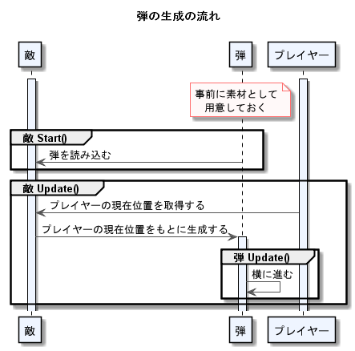
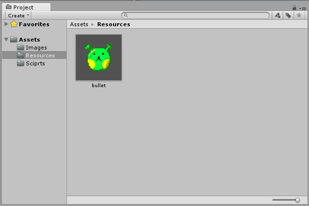

<!-- $theme: gaia -->
<style>
.center{
 text-align: center;
}
.center img {
	width: 65%;
}

</style>

<!-- template: gaia -->

# Unity講座
## 4. 敵をつくる

----
<!-- page_number: true -->
<!-- template: default -->
# 目的

:arrow_right_hook:**==前回==**
画像(自機)を矢印キーで移動させる


:arrow_right:**==今回==**
弾を撃ってくる敵をつくろう

----

## 仕様
- 敵は動かない。
- 敵が弾を作る。
- 弾は自機と同じy座標に生成される。
- 弾は左側(x軸のマイナス方向)に等速で飛んでいく。

----

##### 実行時のプログラムの流れ
<div class="center">

</div>

----

## 実装の流れ(目次)

1. **弾のひな形** の用意
1. **弾の挙動(スクリプト)** を書く
1. **敵** の用意
1. **敵の挙動(スクリプト)** を書く

----
<!-- template: invert -->

# ==1. 弾のひな形の用意==
##### 2. 弾の挙動を書く
##### 3. 敵の用意
##### 4. 敵の挙動を書く

----
<!-- template: default -->

## 弾のひな形の用意

敵が撃つ弾を準備する

弾のように、ゲーム中にオブジェクトを作る
:arrow_right:事前に`Prefab`というひな形を作る

----
### 弾の`Prefab`の作り方

1. 弾の画像をInspectorからFilterModeを`Point`に
1. 画像をProjectからSceneにD&D
1. Hierarchyで選択
   :arrow_right:Scaleを弄り適切な大きさに
1. Hirarchyで選択&右クリック
   :arrow_right:`Rename`で名前を分かり易いものに変更
1. Projectウィンドウで右クリックし:arrow_right:`Create > Folder`で`Resources`フォルダを作成
1. Hierarchyにある弾を`Resources`にD&D
1. Hierarchyにある弾選択&右クリック:arrow_right:`Delete`

----

### ==**TIPS**==
  
:white_check_mark: `Prefab`を置くフォルダの名前は`Resources`以外にしてはいけません。

詳しくはwikiのトップページの下のほうに...  
つまりは、仕様ということです...

----
### ==**TIPS**==  

:white_check_mark: 何か誤操作してもだいたい`Ctrl+Z`で戻せる

:white_check_mark: 名前つけるの間違えたらF2キーで再設定できる

----
これでPrefabの準備が完了
<div class="center">

</div>

----

## Prefabとは:grey_question:
PrefabとGameObjectは違う

**Prefab**
:arrow_right:GameObject+設定済みのComponent群

この場合
:arrow_right:弾のPrefabには既に画像が設定されている
　:arrow_right:このPrefabをゲーム上に生成すれば、
 　　最初から弾の画像が設定されている

----
<!-- template: invert -->

##### 1. 弾のひな形の用意
# ==2. 弾の挙動を書く==
##### 3. 敵の用意
##### 4. 敵の挙動を書く


----
<!-- template: default -->
## 弾の挙動を書く

>横に進む

>弾は左側(x軸のマイナス方向)に等速で飛んでいく。

このように作っていきます。

----

まずはスクリプトファイルの作成

1. Projectウィンドウで右クリック
2. `Create > C# Script`
3. 作られたファイルをダブルクリック

----
:arrow_down:弾のスクリプト(解説します)

```CSharp
using System.Collections;
using System.Collections.Generic;
using UnityEngine;

public class bullet : MonoBehaviour {
    void Update () {
        // 弾の位置情報の抜き出し
        float posX = transform.position.x;
        float posY = transform.position.y;
        
        // 弾の位置の計算
        posX -= 5f * Time.deltaTime;
        
        // 更新
        transform.position = new Vector2 (posX, posY);
    }
}
```


----
### ==**TIPS:**== Time.deltaTimeとは

:arrow_right: １フレームの時間間隔の実測値

<br/>

等速運動のための処理。

----
## 弾の挙動を書く

出来上がった弾のスクリプトをProjectウィンドウのPrefabにくっつける

:warning:この時点では実行しても特に変化はない

----

## :boom:**注意**  

クラス名とファイル名は常に同一でなければならない
  

- プログラムをGameObjectにくっつけられない
- プログラムコンポーネントに:warning:マークが出ている

  


----
<!-- template: invert -->

##### 1. 弾のひな形の用意
##### 2. 弾の挙動を書く
# ==3. 敵の用意==
##### 4. 敵の挙動を書く

----
<!-- template: default -->
## 敵の用意

弾を撃ちだす敵が必要。

1. えっくちゅをもう一体ProjectウィンドウからSceneビューにD&D
1. Hierarchyで右クリックし、`Rename`で名前を分かり易いものに変える
1. `SpriteRenderer`コンポーネントの`Color`プロパティを赤色に弄る
1. `Transform`コンポーネントの`Scale`をいじり、大きくする
1. それっぽくなる

----

これで敵の用意が出来た
<div class="center">

</div>

----
<!-- template: invert -->

##### 1. 弾のひな形の用意
##### 2. 弾の挙動を書く
##### 3. 敵の用意
# ==4. 敵の挙動を書く==

----
<!-- template: default -->

## 敵の挙動を書く
==仕様==曰く、

> - 敵は動かない。
> - 敵が弾を作る。
> - 弾は自機と同じy座標に生成される。

----

==実行時のプログラムの流れ==曰く、

> `Start()`内で **事前に用意しておいた弾** を読み込む。

> `Update()`内で自機の位置を取得して、この情報をもとに **読み込んでおいた弾** をゲーム上に生成する。

----

まずは`Start()`内で`弾のPrefab`の読み込み処理。

----
## 敵の`Start()`を書く
#### `Prefab`の読み込み

:arrow_down: `Prefab`を(GameObjectとして)読み込む。

```CSharp
Resources.Load <GameObject>(  リソースフォルダ内ので名前  );
```

<br/>

:arrow_down: `弾のPrefab`を読み込む。

```CSharp
GameObject bullet = Resources.Load <GameObject>("bullet");
```

これを`Start()`内に書いたらOK...ではない

----
#### 変数の寿命についてのお話

(wikiにて説明)

:arrow_down: 最初の

```CSharp
void Update(){
    GameObject bullet
        = Resources.Load <GameObject>("bullet");
}
```

:arrow_down: 結論

```CSharp
GameObject bullet;
void Update(){
    bullet = Resources.Load <GameObject>("bullet");
}
```

----

ここまでで`弾のPrefab`の読み込みが完了

:arrow_down:

次は`Update()`内の処理

----
## 敵の`Update()`を書く

自機の現在位置を取得
:arrow_right:それをもとにゲーム上に弾を生成

まずは自機の現在位置の取得

----
### 自機の現在位置の取得
「自機の現在位置を取得する」という処理は

- ==ゲーム上に存在する自機を取得する。==
- ==取得した自機から位置情報を抜き出す。==

からなる。

----
### 自機の取得

:arrow_down:ゲーム上に存在するゲームオブジェクトの取得
```CSharp
GameObject.Find(  ここにHierarchy上での名前を書く  );
```

:arrow_down:`"me"`の取得
```CSharp
GameObject target = GameObject.Find("me");
```

`target`は自機を指す。

<br/>

自機の取得完了！

----
### 自機の位置情報を抜き出す

自機の位置情報の取り出し方
:arrow_right: `target.transform.position.y`

<br/>

<br/>

<br/>

### ==**TIPS:**==
ドット`.`という記号
:arrow_right: 日本語の「の」（所有格）


----
:arrow_down:今までのところ
```CSharp
void Update () {
    // 自機の取得
    GameObject target = GameObject.Find("me");
    
    // 自機のy座標を抜き出す
    float targetPosY = target.transform.position.y;
}
```

<br/>

続いて弾を生成します。

----
### 弾の生成
:arrow_down:GameObjectをゲーム上に生成する。

```CSharp
Instantiate (  生成したいGameObject型の変数  );
```

:arrow_down:先ほど読み込んだ`bullet`をゲーム上に生成する。

```CSharp
Instantiate (bullet);
```

<br/>

==**問題点**==
**自機と同じy座標にない！**

----

==**解決策**==
`Instantiate()`関数の返り値を使う。

```CSharp
// 弾の生成
GameObject clone = Instantiate (bullet);

// 生成された弾(clone)の位置を変更。
clone.transform.position = new Vector2 (-4f, targetPosY);
```
----

:arrow_down:`Update()`内部

```CShape
void Update () {
    // 自機の取得
    GameObject target = GameObject.Find("me");

    // 自機のy座標を抜き出す
    float targetPosY = target.transform.position.y;
    
    // 弾の生成
    GameObject clone = Instantiate (bullet);

    // 生成された弾(clone)の位置を変更。
    clone.transform.position
        = new Vector2 (-4f, targetPosY);
}
```

スクリプトを敵にくっつけて
ここまででとりあえず実行...

----

##### 何かおかしい...

----
### ==解決策==
弾の生成に間隔を設ける

:arrow_down:

==実時間の1秒ごとに弾を生成する==ことにします。

----

```CSharp
float time;

void Start () {
    // 弾読み込み処理

    // 変数の初期化
    time = 0;
}

void Update () {
    time += Time.deltaTime;
    
    if (time >= 1f) {
        // ここに弾の生成処理(wikiには書いてある)。
        
        // time変数の値を0に戻す。
        time = 0;
    }
}
```

解説します。wikiも参照。

----

<!-- template: invert -->

##### 1. 弾のひな形の用意
##### 2. 弾の挙動を書く
##### 3. 敵の用意
##### 4. 敵の挙動を書く

# ==完成!==


----
<!-- template: default -->

##### 今回新しく学んだこと

- シューティングゲームの弾のように、ゲームの最初からはなく、大量生産されるものには`Prefab`を使う。  
  :arrow_right:`Prefab`の作り方

- `Prefab`を読み込んで、ゲーム上に生成する。  
  :arrow_right:`Resources.Load`関数、`Instantiate`関数
	
- `Hierarchy`上にあるゲームオブジェクトの取得。  
  :arrow_right:`GameObject.Find`関数
	
- 他のゲームオブジェクトの位置情報の取得。  
  :arrow_right:`(ゲームオブジェクト).transform.position`


----
<!-- template: gaia -->
<!-- page_number: false -->

# やってみよう！

###### 分からないことがあったら周囲の先輩に聞いてください


