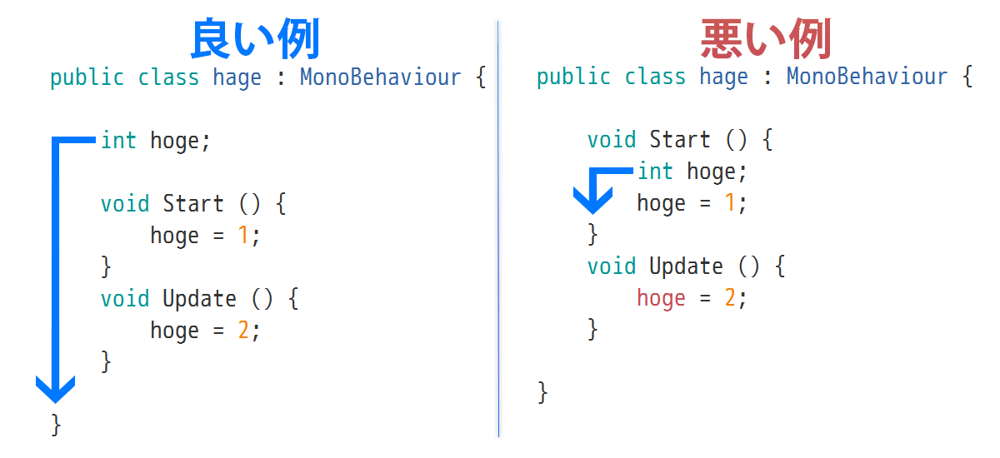

<!-- $theme: gaia -->
<style>
.center{
 text-align: center;
}
</style>

<!-- template: gaia -->

# Unity講座
## 4. 敵をつくる

----
<!-- page_number: true -->
<!-- template: default -->
# 目的

:arrow_right_hook:**==前回==**
画像(プレイヤー)を矢印キーで移動させる

<br/>

:arrow_right:**==今回==**
弾を撃ってくる敵をつくろう

----

## 仕様
- 敵は動かない
- 敵が弾を作る
- 弾はプレイヤーと同じy座標に生成される
- 弾は左側(x軸のマイナス方向)に等速で飛んでいく

----

##### 実行時のプログラムの流れ
<div class="center">

</div>

----

## 実装の流れ

1. **弾のひな形** の用意
1. **弾の挙動(スクリプト)** を書く
1. **敵** の用意(第3回でやりました)
1. **敵の挙動(スクリプト)** を書く

----
<!-- template: gaia -->

# 1. 弾のひな形の用意
##### ==2. 弾の挙動を書く==
##### ==3. 敵の用意(第3回でやった)==
##### ==4. 敵の挙動を書く==

----
<!-- template: default -->

### 1. 弾のひな形の用意

弾ではなく **弾のひな形** :arrow_left:ここ重要

なんで？
- 最初から存在するわけではなく途中で出てくる
- 同じものがたくさん出てくる

----
### 1. 弾のひな形の用意

最初から存在するわけではなく途中からたくさん出てくるものは

1. **ひな形** を作る
1. ゲーム中にひな形の **クローン** を作る

ひな形 : **Prefab**
:arrow_right:弾のPrefabをつくる

----

###### 1. 弾のひな形の用意
### 弾の`Prefab`の作り方(1)

1. 弾に使う画像を資料ページから用意
1. 弾の画像をInspectorからFilterModeを`Point`に
1. 画像をProjectからSceneにD&D
1. Hierarchyで選択
   :arrow_right:Scaleを弄り適切な大きさに
1. Hirarchyで選択&右クリック
   :arrow_right:`Rename`で名前を分かり易いものに変更

----
###### 1. 弾のひな形の用意
### 弾の`Prefab`の作り方(2)

1. Projectウィンドウで右クリック
   :arrow_right:`Create > Folder`で`Resources`フォルダを作成
1. Hierarchyにある弾を`Resources`にD&D
1. Hierarchyにある弾選択&右クリック:arrow_right:`Delete`

<br/>

:warning: `Prefab`を置くフォルダの名前は`Resources`以外にしてはいけません


----
###### 1. 弾のひな形の用意
### ==**TIPS**==  

:white_check_mark: 何か誤操作してもだいたい`Ctrl+Z`で戻せる
　:warning:Projectウィンドウの操作は戻せない

:white_check_mark: ファイルやオブジェクトの名前はF2キーで再設定できる

----
### 1. 弾のひな形の用意
これでPrefabの準備が完了
<div class="center">

</div>

----
###### 1. 弾のひな形の用意
## Prefabとは:question:
PrefabとGameObjectは違う

**Prefab**
　:arrow_right:GameObject+設定済みのComponent群

この場合
:arrow_right:弾のPrefabには既に画像が設定されている
　:arrow_right:このPrefabをゲーム上に生成すれば、
 　　最初から弾の画像が設定されている

----
<!-- template: gaia -->

##### ==1. 弾のひな形の用意==
# 2. 弾の挙動を書く
##### ==3. 敵の用意(第3回でやった)==
##### ==4. 敵の挙動を書く==


----
<!-- template: default -->
## 2. 弾の挙動を書く


### ==仕様==
- 横に進む
- 弾は左側(x軸のマイナス方向)に等速で飛ぶ

---

## 2. 弾の挙動を書く
まずはスクリプトファイルの作成(復習)

1. Projectウィンドウで右クリック
2. `Create > C# Script`
3. 作られたファイルをダブルクリック
----

<!-- template: invert -->
###### 2. 弾の挙動を書く
:arrow_down:弾のスクリプト(解説します)

```CSharp
public class bullet : MonoBehaviour {
    void Update () {

        <弾の位置情報の抜き出し>
        float posX = transform.position.x;
        float posY = transform.position.y;

        <弾の位置の計算>
        posX += -5f * Time.deltaTime;

        <更新>
        transform.position = new Vector2 (posX, posY);
    }
}
```

----
<!-- template: invert -->

######  Time.deltaTimeとは

:thumbsdown:**問題点** : 等速で移動しない
```CSharp
posX += -5f;
```
1フレームの時間間隔は一定ではないため

:thumbsup:**解決策** : 速度に変化時間をかける

1フレームあたりの変化時間 : `Time.deltaTime`

```CSharp
posX += -5f * Time.deltaTime;
```

----
###### 2. 弾の挙動を書く
```CSharp
public class bullet : MonoBehaviour {
    void Update () {
        <弾の位置情報の抜き出し>
        float posX = transform.position.x;
        float posY = transform.position.y;
        <弾の位置の計算>
        posX += -5f * Time.deltaTime;
        <更新>
        transform.position = new Vector2 (posX, posY);
    }
}
```
弾のスクリプトをProjectのPrefabにくっつける

----
<!-- template: gaia -->

##### ==1. 弾のひな形の用意==
##### ==2. 弾の挙動を書く==
# 3. 敵の用意(第3回でやった)
##### ==4. 敵の挙動を書く==

----
<!-- template: gaia -->

##### ==1. 弾のひな形の用意==
##### ==2. 弾の挙動を書く==
##### ==3. 敵の用意(第3回でやった)==
# 4. 敵の挙動を書く

----
<!-- template: default -->

## 4. 敵の挙動を書く
==仕様==曰く、
- 敵は動かない
- 敵が弾を作る
- 弾はプレイヤーと同じy座標に生成される

==実行時のプログラムの流れ==曰く、

- `Start()`内で **事前に用意しておいた弾** を読み込む
- `Update()`内でプレイヤーの位置を取得して、この情報をもとに **読み込んでおいた弾** をゲーム上に生成する

----

## 4. 敵の挙動を書く
まずは敵用のスクリプトを用意 ==(復習)==

1. Projectウィンドウで右クリック
2. `Create > C# Script`
3. 作られたファイルをダブルクリック

----

###### 4. 敵の挙動を書く
### 敵の Start() を書く


#### ==Start()でやること==

**事前に用意しておいた弾** を読み込む
:arrow_right: 弾のPrefabを読み込む


----

###### 4. 敵の挙動を書く > 敵のStart()を書く
### Prefabの読み込み

:arrow_down: Prefabを==GameObjectとして==読み込む
```CSharp
Resources.Load <GameObject>(  リソースフォルダ内ので名前  );
```

<br/>

:arrow_down: 弾の`Prefab`を読み込む

```CSharp
GameObject bullet = Resources.Load <GameObject>("bullet");
```

:warning:これを`Start()`内に書いたらOKではない

----
<!-- template: default -->

###### 4. 敵の挙動を書く > 敵のStart()を書く
### Prefabの読み込み

:warning:Start()内で変数宣言をするとUpdate()で使えない

<div class="center">

</div>

----
<!-- template: invert -->

###### 4. 敵の挙動を書く > 敵のStart()を書く
### Prefabの読み込み

:arrow_down: さっきの(ダメ)
```CSharp
void Start(){
    GameObject bullet;
    bullet = Resources.Load <GameObject>("bullet");
}
```
:arrow_down: こうする
```CSharp
GameObject bullet;
void Start(){
    bullet = Resources.Load <GameObject>("bullet");
}
```

----
###### 4. 敵の挙動を書く > 敵のStart()を書く

```CSharp
using System.Collections;
using System.Collections.Generic;
using UnityEngine;

public class enemy : MonoBehaviour {

    GameObject bullet;

    void Start () {
        bullet = Resources.Load <GameObject>("bullet");
    }

    void Update () {
        <bulletを使った処理>
    }
}
```
----
<!-- template: default -->
###### 4. 敵の挙動を書く
## 敵のUpdate()を書く

<br/>

### ==流れ==

1. プレイヤーの現在位置を取得
	1. ゲーム上に存在するプレイヤーを取得する
	1. 取得したプレイヤーから位置情報を抜き出す
1. その情報をもとにゲーム上に弾を生成

----
<!-- template: invert -->
###### 4. 敵の挙動を書く > 敵のUpdate()を書く
### プレイヤーの取得

:arrow_down:ゲーム上に存在するゲームオブジェクトの取得
```CSharp
GameObject.Find(  ここにHierarchy上での名前を書く  );
```

<br/>

:arrow_down:プレイヤーの取得 (Hierarchy上の名前は`me`)
```CSharp
GameObject target = GameObject.Find("me");
```

`target`はプレイヤーを指す。
プレイヤーの取得完了！

----
###### 4. 敵の挙動を書く > 敵のUpdate()を書く
### プレイヤーの位置情報を抜き出す

:arrow_down: `target`のy座標の取り出し方
```CSharp
<プレイヤーの取得>
GameObject target = GameObject.Find("me");

<プレイヤーのy座標を抜き出す>
float targetPosY = target.transform.position.y;
```

これでプレイヤーの現在位置の取得が完了！

----

###### 4. 敵の挙動を書く > 敵のUpdate()を書く
## 弾の生成

:arrow_down:GameObjectをゲーム上に生成する
```CSharp
Instantiate (  生成したいGameObject型の変数  );
```

:arrow_down:先ほど読み込んだ`bullet`をゲーム上に生成する
```CSharp
Instantiate (bullet);
```

----
<!-- template: default -->
###### 4. 敵の挙動を書く > 敵のUpdate()を書く
## 弾の生成

==:thumbsdown:**問題点**==
生成した弾が **プレイヤーと同じy座標にない**

==:thumbsup:**解決策**==
==生成されたGameObject==のY座標を設定する
:arrow_right:Instantiate関数の返り値を受け取る

----
<!-- template: invert -->
###### 4. 敵の挙動を書く > 敵のUpdate()を書く
## 弾の生成
:arrow_down: 弾をプレイヤーのy座標に生成
```CSharp
<弾の生成>
GameObject clone = Instantiate (bullet);

<生成された弾の位置を変更>
clone.transform.position = new Vector2 (4f, targetPosY);
```
----
###### 4. 敵の挙動を書く > 敵のUpdate()を書く

:arrow_down: ここまでの`Update()`の中身

```CShape
void Update () {
    <プレイヤーの取得>
    GameObject target = GameObject.Find("me");

    <プレイヤーのy座標を抜き出す>
    float targetPosY = target.transform.position.y;

    <弾の生成>
    GameObject clone = Instantiate(bullet);

    <生成された弾(clone)の位置を変更>
    clone.transform.position
        = new Vector2 (4f, targetPosY);
}
```

一旦実行してみる

----
<!-- template: default -->
###### 4. 敵の挙動を書く > 敵のUpdate()を書く
## 弾の生成

==:thumbsdown:**問題点**==
弾の生成間隔が短い

==:thumbsup:**解決策**==
弾の生成間隔を設ける
:arrow_right: **1個/秒** つくる処理に変更

----
<!-- template: invert -->
###### 4. 敵の挙動を書く > 弾の生成間隔を設ける

```CSharp
float time;

void Start () {
    <ここに弾読み込み処理>
    <変数の初期化>
    time = 0;
}

void Update () {
    time += Time.deltaTime;

    if (time >= 1f) {
        <ここに弾の生成処理>
        <time変数の値を0に戻す>
        time = 0;
    }
}
```

----

<!-- template: gaia -->

##### ==1. 弾のひな形の用意==
##### ==2. 弾の挙動を書く==
##### ==3. 敵の用意==
##### ==4. 敵の挙動を書く==

# 完成!


----
<!-- template: default -->

## まとめ

- ゲームの最初からはなかったり大量生産されるものには**Prefab**を使う

- **Prefab**を読み込んで、ゲーム上に生成する
  :arrow_right:`Resources.Load()`、`Instantiate()`

- Hierarchy上にあるゲームオブジェクトの取得
  :arrow_right:`GameObject.Find()`

- 他のゲームオブジェクトの位置情報の取得
  :arrow_right:`(ゲームオブジェクト).transform.position`


----
<!-- template: gaia -->
<!-- page_number: false -->

# おわり

###### 分からないことがあったら周囲の先輩に聞いてください
###### wikiのほうに自由課題があるのでそちらもどうぞ
