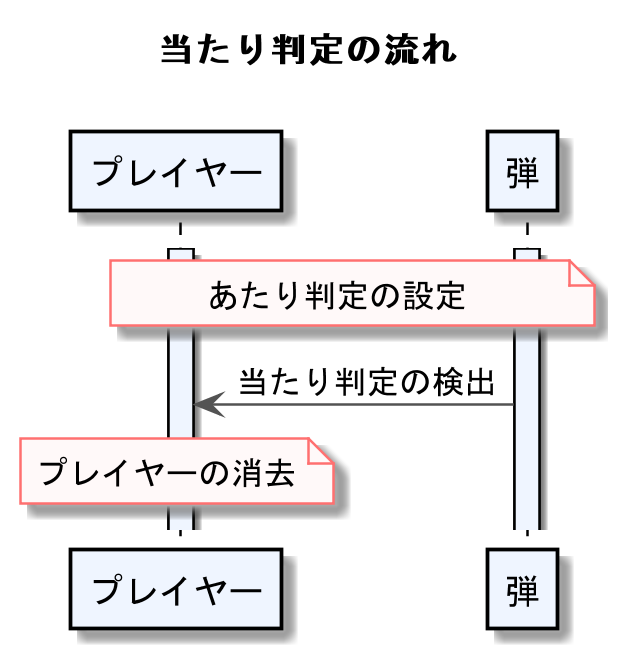
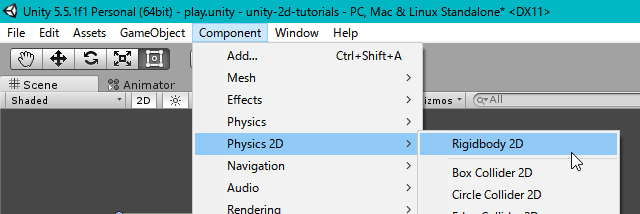
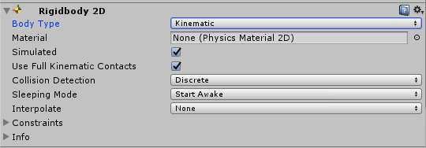
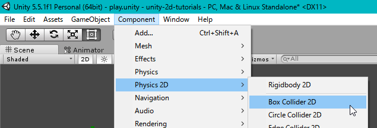
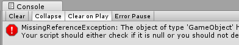

<!-- $theme: gaia -->
<style>
.center{
 text-align: center;
}
</style>

<!-- template: gaia -->

# Unity講座
## 5.当たり判定

----
<!-- page_number: true -->
<!-- template: default -->
# 目的

:arrow_right_hook:**==前回==**
- プレイヤーの移動
- 敵が弾を撃つ


:arrow_right:**==今回==**
弾がプレイヤーにあたったら死ぬ(消える)

----

##### プログラムの流れ
<div class="center">

</div>

----
# 1
# 当たり判定の準備
----

### 物理演算

ゲームで実世界のような物理挙動をさせる大切な要素

一般に当たり判定は物理演算の1つ

**==<例>==**
ボールを投げて地面に==当たったら==跳ね返る


:arrow_right:当たり判定は物理演算に無くてはならない存在

----

### Unityで物理演算

Unityで物理演算をさせたい
　　　　　:arrow_down:
物理演算させたいオブジェクト + `Rigidbody`


----
### Unityで物理演算

今回、当たり判定を行いたいのは

- プレイヤー
- 弾

なので、この2つにくっつける

---
### Unityで物理演算


1. HierarchyまたはProjectからオブジェクトを選択
2. Component > Physics2D > Rigidbody2D
  
<div class="center">

</div>


これをプレイヤーと弾の両方において行う

----

#### :collision:Prefabをいじるときの注意

PrefabをHierarchyに残していませんか？

Hierarchy上のPrefabを変更
:arrow_right:設定が変わるのは今Hierarchyにある1つのみ

- あくまでHierarchyにあるのはPrefabの実体  
- 素材としてのPrefabに変更は適用されない
  
HierarchyにあるPrefabの実体は必ず消して、
Projectウィンドウから変更しよう

----

### Rigidbodyの設定

続いて、どのような物理挙動をさせるか設定する


:scream:この状態で実行してみよう

プレイヤーも弾もプログラムから動かしている
:arrow_right:自然落下などの物理演算をさせてはいけない


----
### Rigidbodyの設定

Rigidbodyコンポーネントを設定しよう

1. BodyType : `Dynamic` -> `Kinematic`
DynamicとKinematicで設定項目が変わるので注意
2. Use Full Kinematic Contacts : :white_check_mark:

<div class="center">

</div>

これもプレイヤーと弾の両方に行う

----
#### 判定範囲の設定

どの範囲から当たり判定を行うか指定する
　:arrow_right:`Collider`コンポーネントを付与

1. プレイヤーをHierarchy選び、 `Component > Physics2D > Circle Collider 2D`  
2. 弾をProjectから選び、`Component > Physics2D > Box Collider 2D`  

<div class="center">

</div>

----

#### 判定範囲の設定

当たり判定
:arrow_right:「プレイヤーと弾が重なっているか」を知るため

==実際に衝突させるわけではない==
:arrow_right:そこで使うのがトリガー
　:arrow_right:実際にぶつからないが、
 　　接触しているかどうかプログラムから取得出来る

2つの判定エリアが重なっているかどうかのみ検出
:arrow_right:両方のコライダの`IsTrigger`項目にチェック

----

# 2
# 当たり判定の検出


----
### 当たり判定の検出

検出方法には以下の3通り

```CSharp
<1> 2つのコライダが重なった瞬間の検出
void OnTriggerEnter2D(Collider2D c){}

<2> 2つのコライダが重なっている間ずっと検出
void OnTriggerStay2D(Collider2D c){}

<3> 2つのコライダが重なり終わった瞬間の検出
void OnTriggerExit2D(Collider2D c){}
```

今回の場合は==1と2のどちらでもOK==

以下の例では2を使います。

----
### 当たり判定の検出

検出は以下のように書く

```CSharp
void OnTriggerStay2D(Collider2D c){
	<2つのコライダが重なっている間実行される処理>
}
```

----
### 当たり判定の検出

ちなみに、IsTriggerが無効だった場合はいかの3通り

チェックを入れなかった場合==検出方法が変わる==

```CSharp
void OnCollisionEnter2D(Collision2D c){}
void OnCollisionStay2D(Collision2D c){}
void OnCollisionExit2D(Collision2D c){}
```

----

###  自機の消滅
コンポーネント・オブジェクトの削除
:arrow_right:`Destroy()`関数

```CSharp
	Destroy(this);
```
さて、上記の例において、`this`とは:grey_question:  

:arrow_right:`this`とは、プログラムコンポーネント自身

もしこれを書いても、
削除されるのはプログラムコンポーネントのみ

----
###  自機の消滅

GameObjectごと削除する場合、以下のように書く

```CSharp
	<自身がくっついているGameObjectを削除する>
	Destroy(this.gameObject);
```

----

### 実装
それでは、弾がプレイヤーに当たったら消えるプログラムを書いてみましょう。  
プレイヤーのプログラムに以下を追記しましょう。

```CSharp
void OnTriggerStay2D (Collider2D c){
    Destroy (this.gameObject);
}
```

この状態で実行してみましょう。  
弾に当たったらプレイヤーが消滅するのが分かると思います。

----

### 当たった先の識別

これで一見今日の目標は達成:satisfied:

:thumbsdown:**==問題点==**
この状態だとプレイヤーは==何に当たっても死ぬ==


:thumbsup:**==解決策==**
プレイヤーが当たった相手は何なのか判定
　:arrow_right:敵だったら死ぬ

----

### Tagの設定

GameObjectに識別は2通り
:arrow_right:GameObjectの名前をみる
:arrow_right:GameObjectのタグをみる


名前で識別
:arrow_right:今後弾以外の敵を追加したとき、
　いちいち条件を書き加える必要がある

GameObjectに「タグ」を付けることで、
一括で識別できるようにする

----
### Tagの設定

1. Projectウィンドウから弾のプレハブを選択
2. Inspector上部のTagから`Add Tag`を選択
3. 画面右の`+`ボタンを押し`Enemy`タグを追加
4. 再度Projectウィンドウから弾のプレハブを選択
5. Inspectorから`Enemy`タグを設定

これでタグ付けが出来た
以降生成される弾はすべて、
==`Enemy`のタグがついているか==どうかで識別可能

----

### 実装

当たり判定の検出の際、相手が本当に敵であるか確認
:arrow_right:`OnTriggerStay2D()`関数を以下のように編集

```CSharp
void OnTriggerStay2D (Collider2D c){
	if (c.gameObject.tag == "Enemy")
		Destroy (this.gameObject);
}
```

タグ情報は`GameObject`にくっていている情報なので、
```
衝突相手のコライダ > そのGameObject > そこにくっついてるタグ 
```

と参照する

----
### Tagの設定


これで敵にぶつかったときのみプレイヤーが死ぬ

今後は敵の種類を追加する際も、
敵に`Enemy`タグを追加するだけでOK

----
### プレイヤー消滅後のエラー

これで今日の目的は達成  :satisfied:

しかし、プレイヤーの消滅後にConsoleにエラー

<div class="center">

</div>

書かれていることはとても単純 
Unityのエラーメッセージでは、
- 冒頭にエラーの概要
- 最後の行でエラーが引き起こされた原因の行

----
### プレイヤー消滅後のエラー
つまり、  
- 起きたエラー : MissingReferenceException  
- 発生した場所 : enemy.csの21行目

`MissingReferenceException`:参照先が見つからない

----
### プレイヤー消滅後のエラー

この行でエラーが発生  
```CS
targetPosY = target.transform.position.y;
```

敵は、起動時にプレイヤーをターゲットとして捕捉
:arrow_right:そこからフレーム毎にプレイヤーの座標を取得

しかし、弾が当たったタイミングでプレイヤーは消滅  
:arrow_right:消滅以後、敵はプレイヤーを見失う
　:arrow_right:当然座標も取得できない
 
よって、このエラーが発生した

----
### プレイヤー消滅後のエラー対処法

:arrow_right: 自由課題


----
<!-- template: default -->
# まとめ

- 当たり判定
:arrow_right:RigidbodyとColliderをくっつける
:arrow_right:Dynamic(動的)/Kinematic(静的)を見極める
:arrow_right:IsTriggerのオン/オフを見極める
:arrow_right:IsTirggerによって書くプログラムが変わる

- GameObjectの識別
:arrow_right:Tagを付けることで識別しやすくなる


----
<!-- template: gaia -->
<!-- page_number: false -->

# やってみよう！
###### 分からないことがあったら周囲の先輩に聞いてみよう

